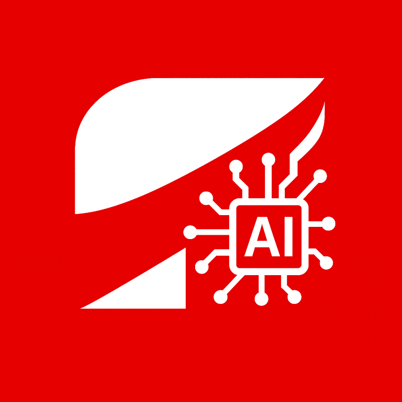

<div align="center">
  
  <h1>Toro AI Assistant</h1>
  <p>A serverless investment Q&A assistant with Retrieval Augmented Generation</p>

  <p>
    <a href="#features"></a>
    <a href="#architecture"></a>
    <a href="#getting-started"></a>
    <a href="#documentation"></a>
  </p>

  <p>
    
    
    
    
  </p>
</div>

<hr>

## Table of Contents

- [Table of Contents](#-table-of-contents)
- [Features](#-features)
- [Architecture](#️-architecture)
- [Getting Started](#-getting-started)
  - [Prerequisites](#prerequisites)
  - [Development Setup](#development-setup)
  - [Deployment](#deployment)
- [API Usage](#-api-usage)
- [Project Structure](#-project-structure)
- [Documentation](#-documentation)
- [Contributors](#-contributors)
- [License](#-license)

<hr>

## Features

Toro AI Assistant is a serverless application that provides contextualized investment answers using AWS services and Retrieval Augmented Generation (RAG).

- **Event-Driven Architecture** - Asynchronous processing with event-based component decoupling
- **RAG Implementation** - Context-aware responses using AWS Bedrock Knowledge Bases
- **Real-time Notifications** - WebSocket integration for instant updates
- **Serverless Approach** - Zero infrastructure management with AWS Lambda
- **Data Persistence** - Reliable storage with DynamoDB
- **Clean Architecture** - Feature-first organization with separation of concerns
- **Comprehensive Testing** - Robust test coverage for critical components

<hr>

## Architecture

Toro AI Assistant follows a serverless, event-driven architecture designed for scalability and reliability.

```
┌─────────────┐     ┌──────────────────┐     ┌────────────┐     ┌───────────────────┐     ┌─────────────┐
│  API Gateway│────▶│ Lambda - Ingest  │────▶│ SNS Topic  │────▶│ Lambda - Process  │────▶│ SNS Topic   │
└─────────────┘     └──────────────────┘     │ (Process)  │     └───────────────────┘     │ (Notify)    │
                           │                 └────────────┘               │               └─────────────┘
                           │                                              │                       │
                           ▼                                              ▼                       ▼
                    ┌─────────────┐                             ┌─────────────────┐      ┌───────────────┐
                    │  DynamoDB   │◀────────────────────────────│ AWS Bedrock     │      │Lambda - Notify│
                    │  Table      │                             │ Knowledge Base  │      └───────────────┘
                    └─────────────┘                             └─────────────────┘              │
                                                                                                 ▼
                                                                                         ┌───────────────┐
                                                                                         │ WebSocket API │
                                                                                         └───────────────┘
```

###  API Gateway
- **REST API** - Handles HTTP requests
- **WebSocket API** - Enables real-time notifications

###  Lambda Functions
- **Ingest** - Receives and validates questions, stores in DynamoDB
- **Process** - Generates responses using RAG with AWS Bedrock
- **Notify** - Sends real-time notifications to users
- **WebSocket Handler** - Manages WebSocket connections

###  Amazon Simple Notification Service (SNS)
- **Process Topic** - Decouples ingest and processing
- **Notify Topic** - Decouples processing and notifications

###  Amazon DynamoDB
- **Questions Table** - Stores questions and responses
- **Connections Table** - Manages WebSocket connections

###  AWS Bedrock and Knowledge Base
- **RAG Implementation** - Retrieves relevant documents and generates contextual responses


## Getting Started

### Prerequisites

- Python 3.11 or higher
- AWS CLI configured with appropriate permissions
- AWS SAM CLI for deployment
- Make (optional, for automation)
- Poetry (optional, for dependency management)

### Development Setup

1. **Clone the repository**

```bash
git clone https://github.com/acn3to/toro-ai-assistant.git
cd toro-ai-assistant
```

2. **Set up your environment**

Using Poetry (recommended):
```bash
# Install Poetry if not already installed
pip install poetry

# Install dependencies
poetry install

# Activate virtual environment
poetry shell
```

Using pip:
```bash
# Create and activate virtual environment
python -m venv venv
source venv/bin/activate  # On Windows: venv\Scripts\activate

# Install dependencies
pip install -r requirements.txt
```

3. **Configure AWS credentials**

Ensure your AWS CLI is configured with proper credentials:
```bash
aws configure
```

For detailed setup instructions, refer to the [Development Environment Setup](docs/setup-dev.md).

### Deployment

Deploy the application using AWS SAM:

```bash
# Build the application
make build
# or
sam build --use-container

# Deploy to AWS
make deploy
# or
sam deploy --guided
```

For comprehensive deployment instructions, see [Deployment Guide](docs/deployment.md).

<hr>

## API Usage

### Send a Question

```bash
curl -X POST https://your-api-endpoint.execute-api.us-east-2.amazonaws.com/Prod/questions \
  -H "Content-Type: application/json" \
  -d '{"user_id": "user123", "question": "What is a CDB?"}'
```

Response:

  ```json
  {
    "success": true,
    "data": {
      "user_id": "user123",
      "question_id": "550e8400-e29b-41d4-a716-446655440000",
      "status": "pending"
    }
  }
  ```

<hr>

## Project Structure

```
.
├── lib/                   # Shared libraries
│   ├── adapters/          # External service clients (DynamoDB, Bedrock)
│   ├── core/              # Utilities, constants, shared functionality
│   ├── factories/         # Client creation
│   ├── models/            # Data models and validation
│   └── utils/             # Utility functions
├── src/                   # Lambda functions
│   ├── questions/         # Question-related Lambdas
│   │   ├── ingest/        # Ingest Lambda - API Gateway entry point
│   │   ├── process/       # Process Lambda - Handles RAG execution
│   │   └── notify/        # Notify Lambda - WebSocket notifications
│   └── websocket/         # WebSocket connection management
├── infra/                 # Infrastructure as code
│   └── serverless-template.yaml  # AWS SAM template
└── tests/                 # Automated tests
    ├── lib/               # Tests for shared libraries
    └── questions/         # Tests for Lambda functions
```

<hr>

## Documentation

<div align="center">
  <table>
    <tr>
      <td align="center"><a href="docs/architecture.md"></a></td>
      <td>Detailed description of the system architecture and components</td>
    </tr>
    <tr>
      <td align="center"><a href="docs/setup-dev.md"></a></td>
      <td>Guide for setting up your development environment</td>
    </tr>
    <tr>
      <td align="center"><a href="docs/deployment.md"></a></td>
      <td>Instructions for deploying the application to AWS</td>
    </tr>
    <tr>
      <td align="center"><a href="docs/clean-code-scalability.md"></a></td>
      <td>Clean code practices and scalability considerations</td>
    </tr>
    <tr>
      <td align="center"><a href="docs/challenge.md"></a></td>
      <td>Original challenge requirements and specifications</td>
    </tr>
  </table>
</div>

<hr>

## Contributors

<table>
  <tr>
    <td align="center">
      <a href="https://github.com/acn3to">
        
        <br />
        <sub><b>Arnaldo Neto</b></sub>
      </a>
      <br />
      <a href="https://www.linkedin.com/in/arnaldo-n3to/" title="LinkedIn">
        
      </a>
    </td>
  </tr>
</table>

<hr>

## License

This project is licensed under the MIT License - see the [LICENSE](LICENSE) file for details.

<br>

<div align="center">
  <a href="#toro-ai-assistant">
    
  </a>
</div>
